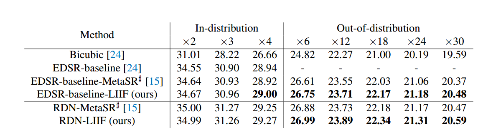
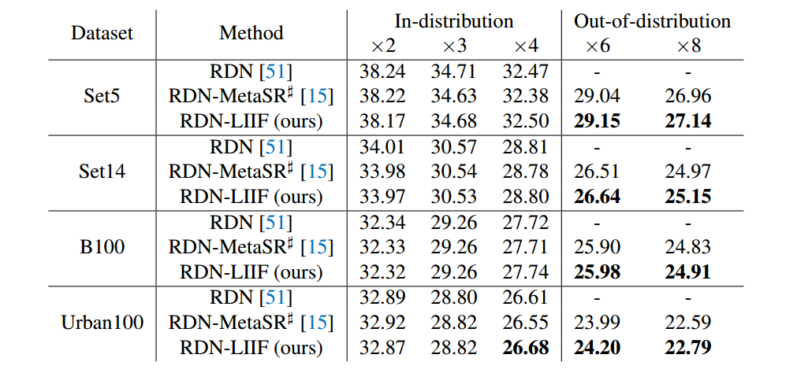
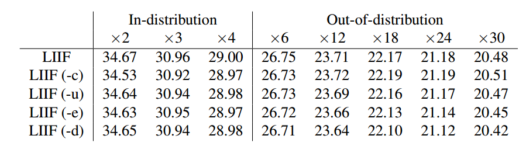
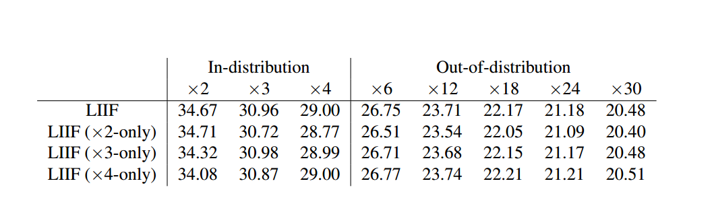

# LIIF (Learning Continuous Image Representation with Implicit Neural Function) 项目

## 📖 项目简介

本项目实现了论文 [Learning Continuous Image Representation with Implicit Neural Function](https://arxiv.org/abs/2012.09161) 中提出的 LIIF 方法，基于论文官方提供的 **PyTorch**源码进行项目重构和 **Jittor**框架迁移的深度学习完整实现。

LIIF 是一种基于隐式神经表示的超分辨率方法，通过学习连续图像表示，能够处理任意尺度的超分辨率任务，在分布内和分布外尺度上都表现出色。

## 🏗️ 项目结构

```
LIIF/
├── liif_torch/                    # PyTorch 版本实现
│   ├── datasets/                  # 数据集相关模块
│   │   ├── __init__.py
│   │   ├── datasets.py           # 数据集注册机制
│   │   ├── image_folder.py       # 图像文件夹数据集
│   │   └── wrappers.py           # 数据包装器
│   ├── logs/                     # 训练日志存储
│   ├── save_model/               # 模型权重保存
│   ├── train-div2k/              # DIV2K 训练配置
│   ├── models.py                 # 模型架构定义
│   ├── train.py                  # 训练脚本
│   ├── test.py                   # 测试脚本
│   ├── utils.py                  # 工具函数库
│   └── test/                     # 测试配置文件
│
└── liif_jittor/                  # Jittor 版本实现
    ├── datasets/                 # 数据集相关模块
    │   ├── __init__.py
    │   ├── datasets_jt.py        # 数据集注册机制
    │   ├── image_folder_jt.py    # 图像文件夹数据集
    │   └── wrappers_jt.py        # 数据包装器
    ├── save_model_jittor_align/  # 模型权重保存
    ├── train-div2k/              # DIV2K 训练配置
    ├── models_jt.py              # Jittor 模型定义
    ├── models_torch.py           # 原始 PyTorch 模型（参考）
    ├── trainon0.py               # 训练脚本(在GPU0上)
    ├── test.py                   # 测试脚本
    ├── utils_jittor.py           # 工具函数库
    ├── demo.py                   # 单图像推理演示
    ├── batch_demo.py             # 批量推理脚本
    └── test/                     # 测试配置文件
```

## 🖥️ 实验环境

### 硬件配置
- **GPU**: NVIDIA RTX 3090 × 2 (24GB × 2)
- **内存**: 125GB DDR4
- **操作系统**: Ubuntu 20.04 LTS
- **训练策略**: 单显卡训练（每个实验约占用 30GB 内存）

### 训练时间参考
- **EDSR 网络**（原论文配置，100 轮收敛）: ~2 小时
- **RDN 网络**（原论文配置，100 轮收敛）: ~10 小时

### 软件环境

| 包名 | 版本 |
|------|------|
| Python | 3.9.23 |
| Jittor | 1.3.10.0 |
| PyTorch | 2.1.0+cu121 |
| torchvision | 0.16.0+cu121 |
| numpy | 1.24.3 |
| Pillow | 10.0.0 |
| imageio | 2.31.1 |
| tensorboardX | 2.6.2.2 |
| tqdm | 4.66.1 |

## 🔄 PyTorch 到 Jittor 迁移心得

详细的迁移总结请参考：[LIIF_PyTorch_to_Jittor_Migration_Guide.md](./liif_jittor/LIIF_PyTorch_to_Jittor_Migration_Guide.md)

本人一些环境搭建及实验记录草稿：[一些实验记录.pdf](./liif_jittor/一些实验记录.pdf)

### 1. API 兼容性

#### 1.1 返回类型差异
大多数 API 接口保持一致，但需要注意返回类型可能不符合预期：
- **PyTorch**: `transforms.ToTensor()` 返回张量
- **Jittor**: `transforms.ToTensor()` 返回 numpy 数组

#### 1.2 实现效果差异
即使接口相同，实现效果也可能不同：

**PyTorch 版本**:
```python
def resize_fn(img, size):
    return transforms.ToTensor()(
        transforms.Resize(size, Image.BICUBIC)(
            transforms.ToPILImage()(img)))
```

**Jittor 版本**:
```python
def resize_fn(img, size):
    # 接受 int 或 (H, W) 格式的尺寸
    if isinstance(size, int):
        target_h, target_w = size, size
    else:
        target_h, target_w = int(size[0]), int(size[1])

    # 确保 img 是 4D 张量 [N, C, H, W]
    if img.ndim == 3:
        img = img.unsqueeze(0)
    
    # 使用正确的参数格式 (H, W)
    out = jt.nn.resize(img, (target_h, target_w), mode='bicubic', align_corners=False)
    return out.squeeze(0)
```

⚠️ **注意**: 虽然指定了相同的方法，但两者实现的实际效果不同，会影响性能对齐（亲身经历）。

### 2. 显存管理

#### 2.1 内存缓存策略
在数据加载部分，为了保持训练速度需要使用 `in_memory` 缓存：

**PyTorch 直接支持**:
```python
elif cache == 'in_memory':
    self.files.append(transforms.ToTensor()(
        Image.open(file).convert('RGB')))
```

**Jittor 需要特殊处理**:
```python
# 大批训练数据直接转换为jittor张量会导致显存报错（怀疑是调度机制问题）
def pil_to_jt_tensor(img_pil):
    arr = np.array(img_pil)
    if arr.ndim == 2:
        arr = arr[..., None]
    arr = arr.astype('float32') / 255.0
    arr = arr.transpose(2, 0, 1).copy()
    return jt.array(arr)  # 返回 Jittor 张量
```

**解决方案**:
```python
# 强制保存在内存而不是显存中
def pil_to_numpy_array(img_pil):
    arr = np.array(img_pil, dtype=np.float32)
    if arr.ndim == 2:
        arr = arr[..., None]
    arr = arr.astype('float32') / 255.0
    arr = arr.transpose(2, 0, 1).copy()
    return arr  # 直接返回 numpy 数组，不转换为 Jittor 张量
```

#### 2.2 GPU 管理
⚠️ **重要**: 谨慎使用 `x.cuda()`，因为 Jittor 会自动管理 GPU 内存，手动指定可能导致显存报错。

另外要注意，torch和jittor两个框架训练时指定GPU的方式也略有不同，设定os.environ['CUDA_VISIBLE_DEVICES'] = 'x'的位置前者可以在训练执行代码前指定即可，而后者必须在导入jittor前就进行指定。

### 3. 训练速度对比

在我们的实现中，**Jittor 训练速度略快于 PyTorch**，特别是在训练后期会加速，这得益于：
- 编译优化
- 算子融合
- 自动内存管理

### 4. 训练流程差异

**Jittor 风格**（简化版本）:
```python
# 传入 loss，内部自动反向传播和更新
optimizer.step(loss)

# 或完整版本
optimizer.zero_grad()
optimizer.backward(loss)
optimizer.step()
```

**PyTorch 风格**:
```python
optimizer.zero_grad()
loss.backward()
optimizer.step()
```

## 📊 双框架对比展示

### 5.1 训练对齐验证

#### 实验 1: EDSR-LIIF Baseline
**100 轮训练 Loss 曲线对比** (PyTorch vs Jittor)


#### 实验 2: EDSR-LIIF Baseline
**100 轮训练 Loss 曲线对比** (PyTorch vs Jittor)


### 5.2 推理效果展示

| 原图 | PyTorch 版本 | Jittor 版本 |
|------|-------------|-------------|
|  |  |  |

## 🧪 论文实验复现

### 网络架构简介

#### EDSR (Enhanced Deep Super-Resolution)
EDSR 是一个经典的超分辨率网络，通过残差块和全局残差连接实现高质量的图像重建。

#### RDN (Residual Dense Network)
RDN 采用密集连接和残差学习，通过多层次特征融合提升超分辨率性能。

#### 方法对比

| 方法 | 特点 |
|------|------|
| **MetaSR** | 基于元学习的方法，为特定尺度训练模型 |
| **LIIF (Ours)** | 学习连续图像表示，支持任意尺度超分辨率 |

### 实验 1: DIV2K 数据集定量对比

**原论文结果**:


**我的双框架实现效果**:

在 DIV2K 验证集上的定量对比 (PSNR (dB))

| 方法 | 分布内尺度 | | | 分布外尺度 | | | | |
|------|------------|------------|------------|------------|------------|------------|------------|------------|
| | ×2 | ×3 | ×4 | ×6 | ×12 | ×18 | ×24 | ×30 |
| **EDSR-baseline-MetaSR** | PyTorch/Jittor | PyTorch/Jittor | PyTorch/Jittor | PyTorch/Jittor | PyTorch/Jittor | PyTorch/Jittor | PyTorch/Jittor | PyTorch/Jittor |
| **EDSR-baseline-LIIF(ours)** | PyTorch/Jittor | PyTorch/Jittor | PyTorch/Jittor | PyTorch/Jittor | PyTorch/Jittor | PyTorch/Jittor | PyTorch/Jittor | PyTorch/Jittor |
| **RDN-LIIF(ours)** | PyTorch/Jittor | PyTorch/Jittor | PyTorch/Jittor | PyTorch/Jittor | PyTorch/Jittor | PyTorch/Jittor | PyTorch/Jittor | PyTorch/Jittor |

### 实验 2: Benchmark 数据集对比

**原论文结果**:


**我的双框架实现效果** (基于 EDSR 网络):

| 数据集 | 方法 | 分布内尺度 | | | 分布外尺度 | |
|--------|------|------------|------------|------------|------------|------------|
| | | ×2 | ×3 | ×4 | ×6 | ×8 |
| **Set5** | EDSR-MetaSR[15] | PyTorch/Jittor | PyTorch/Jittor | PyTorch/Jittor | PyTorch/Jittor | PyTorch/Jittor |
| | EDSR-LIIF (ours) | PyTorch/Jittor | PyTorch/Jittor | PyTorch/Jittor | PyTorch/Jittor | PyTorch/Jittor |
| **Set14** | EDSR-MetaSR[15] | PyTorch/Jittor | PyTorch/Jittor | PyTorch/Jittor | PyTorch/Jittor | PyTorch/Jittor |
| | EDSR-LIIF (ours) | PyTorch/Jittor | PyTorch/Jittor | PyTorch/Jittor | PyTorch/Jittor | PyTorch/Jittor |
| **B100** | EDSR-MetaSR[15] | PyTorch/Jittor | PyTorch/Jittor | PyTorch/Jittor | PyTorch/Jittor | PyTorch/Jittor |
| | EDSR-LIIF (ours) | PyTorch/Jittor | PyTorch/Jittor | PyTorch/Jittor | PyTorch/Jittor | PyTorch/Jittor |
| **Urban100** | EDSR-MetaSR[15] | PyTorch/Jittor | PyTorch/Jittor | PyTorch/Jittor | PyTorch/Jittor | PyTorch/Jittor |
| | EDSR-LIIF (ours) | PyTorch/Jittor | PyTorch/Jittor | PyTorch/Jittor | PyTorch/Jittor | PyTorch/Jittor |

### 实验 3: LIIF 设计选择消融研究

**原论文结果**:


**说明**: 
- `-c`: 移除 cell decoding
- `-u`: 移除 feature unfolding  
- `-e`: 移除 local ensemble
- `-d`: 减少解码函数深度

**我的双框架实现效果** (基于 EDSR 网络):

| 方法 | 分布内尺度 | | | 分布外尺度 | | | | |
|------|------------|------------|------------|------------|------------|------------|------------|------------|
| | ×2 | ×3 | ×4 | ×6 | ×12 | ×18 | ×24 | ×30 |
| **LIIF** | PyTorch/Jittor | PyTorch/Jittor | PyTorch/Jittor | PyTorch/Jittor | PyTorch/Jittor | PyTorch/Jittor | PyTorch/Jittor | PyTorch/Jittor |
| **LIIF (-c)** | PyTorch/Jittor | PyTorch/Jittor | PyTorch/Jittor | PyTorch/Jittor | PyTorch/Jittor | PyTorch/Jittor | PyTorch/Jittor | PyTorch/Jittor |
| **LIIF (-u)** | PyTorch/Jittor | PyTorch/Jittor | PyTorch/Jittor | PyTorch/Jittor | PyTorch/Jittor | PyTorch/Jittor | PyTorch/Jittor | PyTorch/Jittor |
| **LIIF (-e)** | PyTorch/Jittor | PyTorch/Jittor | PyTorch/Jittor | PyTorch/Jittor | PyTorch/Jittor | PyTorch/Jittor | PyTorch/Jittor | PyTorch/Jittor |
| **LIIF (-d)** | PyTorch/Jittor | PyTorch/Jittor | PyTorch/Jittor | PyTorch/Jittor | PyTorch/Jittor | PyTorch/Jittor | PyTorch/Jittor | PyTorch/Jittor |

### 实验 4: 特定尺度训练消融研究

**原论文结果**:


**说明**: `×k-only` 表示仅使用上采样尺度 k 的样本对训练模型。

**我的双框架实现效果** (基于 EDSR 网络):

| 方法 | 分布内尺度 | | | 分布外尺度 | | | | |
|------|------------|------------|------------|------------|------------|------------|------------|------------|
| | ×2 | ×3 | ×4 | ×6 | ×12 | ×18 | ×24 | ×30 |
| **LIIF** | PyTorch/Jittor | PyTorch/Jittor | PyTorch/Jittor | PyTorch/Jittor | PyTorch/Jittor | PyTorch/Jittor | PyTorch/Jittor | PyTorch/Jittor |
| **LIIF (×2-only)** | PyTorch/Jittor | PyTorch/Jittor | PyTorch/Jittor | PyTorch/Jittor | PyTorch/Jittor | PyTorch/Jittor | PyTorch/Jittor | PyTorch/Jittor |
| **LIIF (×3-only)** | PyTorch/Jittor | PyTorch/Jittor | PyTorch/Jittor | PyTorch/Jittor | PyTorch/Jittor | PyTorch/Jittor | PyTorch/Jittor | PyTorch/Jittor |
| **LIIF (×4-only)** | PyTorch/Jittor | PyTorch/Jittor | PyTorch/Jittor | PyTorch/Jittor | PyTorch/Jittor | PyTorch/Jittor | PyTorch/Jittor | PyTorch/Jittor |

---

## 📝 使用说明

### 快速开始

1. **环境配置**:
```bash
pip install -r requirements.txt
```

2. **训练模型**:
```bash
# PyTorch 版本
python train.py --config train-div2k/train_edsr-baseline-liif.yaml --name liif_edsr_baseline_v1  --gpu 0

# Jittor 版本  
python trainon0.py --config train-div2k/train_edsr-baseline-liif.yaml --name liif_edsr_baseline_v1
```

3. **测试模型**:
```bash
# PyTorch 版本
python test.py --config test-div2k/test-div2k-2.yaml --model save_model/edsr_liif_baseline/epoch-best.pth

# Jittor 版本
python test.py --config test-div2k/test-div2k-2.yaml --model save_model_jittor_align/edsr_liif_baseline/epoch-best.pth
```

4. **单图像推理**:
```bash
# Jittor 版本
python demo.py --input new.png --model save_model_jittor_align/edsr_liif_baseline/epoch-best.pth --resolution 320,320 --output result.png
```

5. **批量推理**:
```bash
python batch_demo.py --input new.png --resolution 320,320
```

6. **批量训练**:
```bash
# 使用批量训练脚本
bash batch_0.sh

# 或手动执行单个训练
python trainon0.py --config train-div2k/train_edsr-baseline-liif.yaml --name edsr_liif_baseline --gpu 0
```

7. **批量测试**:
```bash
# 使用批量测试脚本
python batch_test_simple.py

# 或手动执行单个测试
python test.py --config test-div2k/test-div2k-2.yaml --model save_model_jittor_align/edsr_liif_baseline/epoch-best.pth --gpu 0
```

### 批量操作说明

#### 批量训练 (`batch_0.sh`)
批量训练脚本会自动执行多个实验配置：

```bash
# 编辑 batch_0.sh 文件，取消注释需要训练的配置
configs=(
    "train-div2k/train_edsr-baseline-liif.yaml edsr_liif_baseline"
    "train-div2k/ablation/train_edsr-baseline-liif-c.yaml edsr_liif_ablation_c"
    "train-div2k/train_rdn-liif.yaml rdn_liif_v1"
    # ... 更多配置
)

# 执行批量训练
bash batch_0.sh
```

#### 批量测试 (`batch_test_simple.py`)
批量测试脚本会自动：
- 扫描 `save_model_jittor_align/` 目录下的所有模型
- 使用 `test-div2k/` 目录下的所有配置文件进行测试
- 生成详细的测试报告 `testdiv2k_and_benchmark_jittor100.txt`

#### 批量推理 (`batch_demo.py`)
批量推理脚本会：
- 对指定输入图像使用所有训练好的模型进行推理
- 将结果保存到 `demo_result/` 目录
- 生成推理日志 `demo_batch_log.txt`

## 📄 公开

本项目开源。

## 🙏 致谢

- 感谢原论文作者提供的优秀工作
- 感谢 Jittor 团队提供的深度学习框架
- 感谢 PyTorch 团队提供的深度学习框架

## 📞 联系方式 2210529@mail.nankai.edu.cn

如有问题或建议，欢迎提交 Issue 或 Pull Request。


