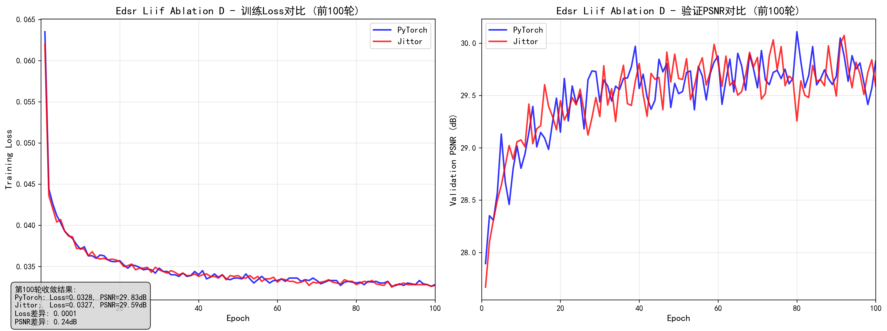
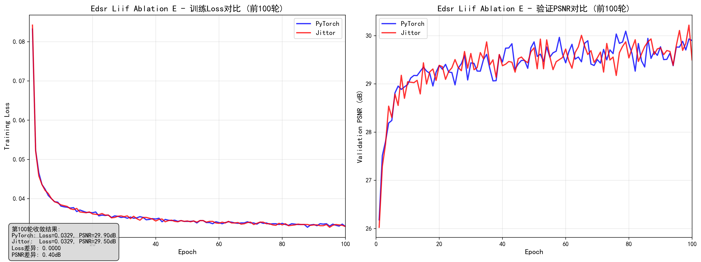
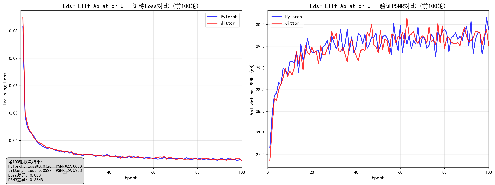
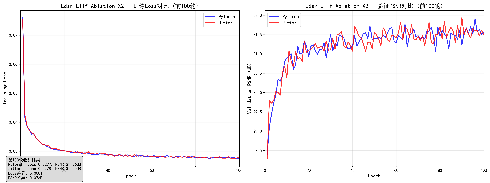
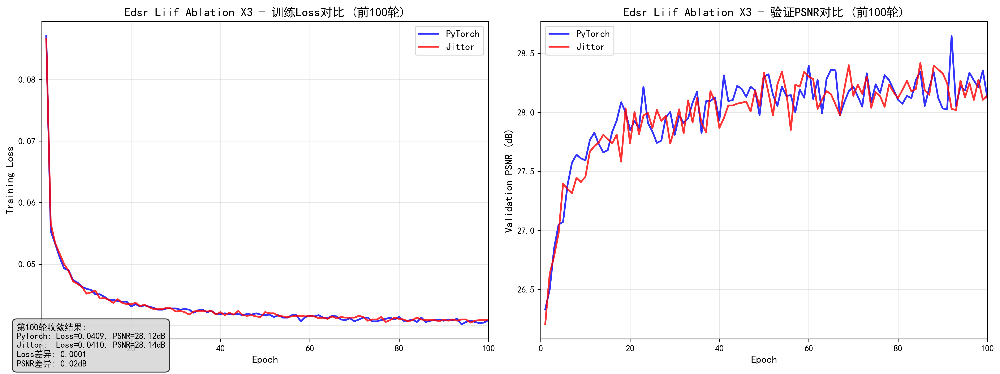
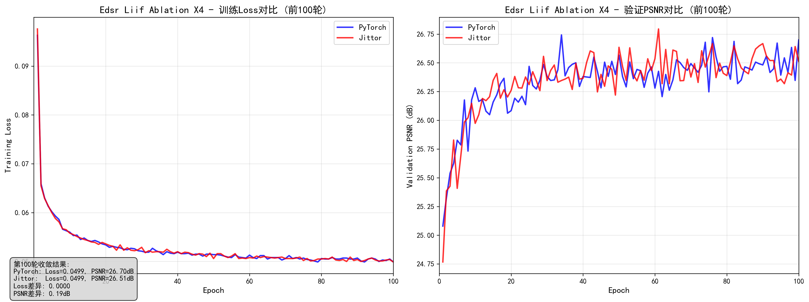
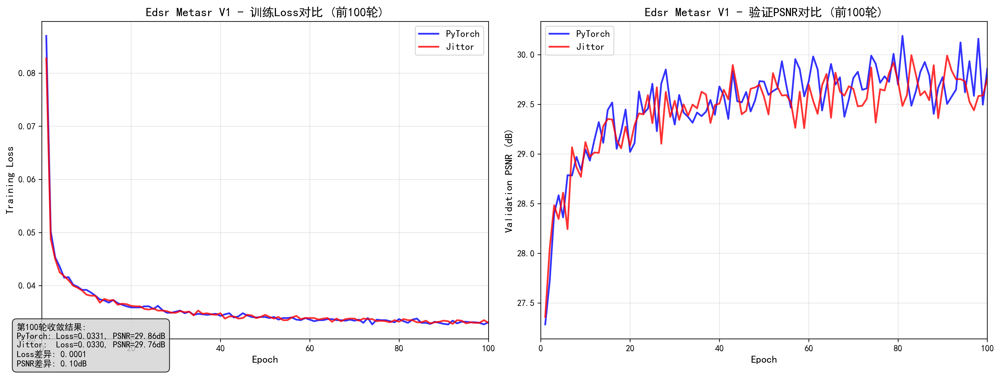
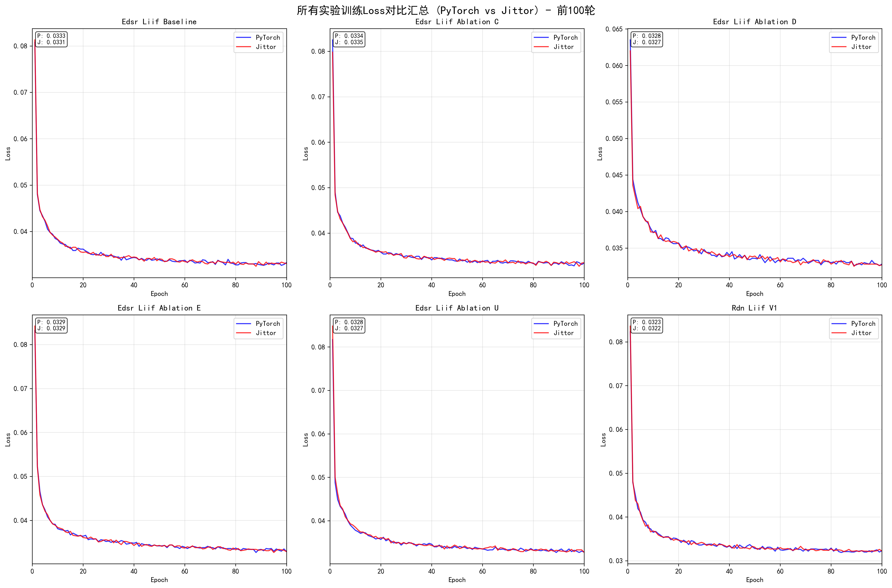

# 📊 LIIF PyTorch-Jittor 训练曲线完整展示

## 📈 训练对齐验证

### 所有实验双框架对比

#### 1. EDSR-LIIF Baseline

#### 2. RDN-LIIF  

#### 3. EDSR-LIIF Ablation (-c)

#### 4. EDSR-LIIF Ablation (-d)

#### 5. EDSR-LIIF Ablation (-e)

#### 6. EDSR-LIIF Ablation (-u)

#### 7. EDSR-LIIF Ablation (×2-only)

#### 8. EDSR-LIIF Ablation (×3-only)

#### 9. EDSR-LIIF Ablation (×4-only)

#### 10. EDSR-MetaSR

## 📊 模型训练趋势总览

---

**返回主项目**: [LIIF PyTorch-Jittor 迁移项目](../..)
